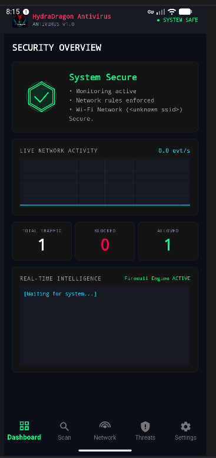

# 🐉 HydraDragonAV Mobile
**Advanced Android Antivirus With Threat Protection**

## Discord Community Server: https://discord.gg/7XMCuj5mbP




HydraDragonAV Mobile is a multi-layered Android Antivirus and Security suite combining static analysis (YARA-X + ClamAV signatures + code anomaly detection), dynamic behavior analysis, and a lightweight on-device ML classifier — all gated by a NSRL-backed whitelist so known-good software is never a false positive. Designed with a **Zero-Trust architecture**, it actively defends the device against ransomware, clickjacking, spyware, SMS scams/phishing, and zero-day threats.

> **📋 Requirements: Android 10 (API 29) or newer.** The per-app dynamic network
> analysis — attributing each DNS/connection to the exact app that made it and
> feeding it to the YARA-X `hydradragon` module — relies on
> `ConnectivityManager.getConnectionOwnerUid`, which is only available on
> Android 10+. On older versions the rest of the suite still runs, but per-app
> connection attribution is unavailable.

> **🤖 Android-only detection scope.** This is a minimalist, Android-focused
> fork of the original [HydraDragonAntivirus](https://github.com/HydraDragonAntivirus/HydraDragonAntivirus) —
> it only detects Android malware. The native scan engine only runs its
> ClamAV/YARA-X signature matching on files it can confidently identify as an
> Android-relevant type (APK/ZIP, DEX, ELF, HTML, ASCII text, PDF, images);
> desktop-only formats (Windows PE, OLE2/Office, Mail, Mach-O, Java) and files
> of an indeterminate type are skipped entirely, rather than scanned with a
> signature database that was never meant for them. For more details, see the
> [wiki](https://github.com/HydraDragonAntivirus/HydraDragonAV-Mobile/wiki)
> ([ClamAV Integration](https://github.com/HydraDragonAntivirus/HydraDragonAV-Mobile/wiki/ClamAV-Integration),
> [Known Limitations](https://github.com/HydraDragonAntivirus/HydraDragonAV-Mobile/wiki/Known-Limitations)).

## 🚀 Key Features

- **⚡ Photon Technology:** Ultra-fast, multi-threaded scanning engine utilizing `ConcurrentHashMap` caching to instantly re-verify previously scanned safe applications with zero CPU overhead.
- **🧠 Native Rust Scan Engine:** A JNI-bridged Rust core (`libhydradragonandroid.so`) does the heavy lifting — YARA-X + ClamAV signature matching, archive extraction (zip/gz/tar/xz/lzma/7z/rar, including nested APKs), AXML manifest parsing, and dangerous-permission counting, all straight from bytes in memory (no temp files required).
- **🔎 One-Class ML Anomaly Detection:** A MinHash/LSH + Isolation Forest model scores every scanned sample with a Jaccard similarity and anomaly score, flagging outliers that don't match any known-clean or known-malware profile — a lightweight logistic-regression classifier (`AIEngine`) also scores DEX-level behavior (obfuscation, dynamic loading, crypto/socket/shell APIs, adware SDKs).
- **🧬 TLSH Fuzzy Hashing:** Compares scanned APK/ELF/DEX files against a MalwareBazaar-derived TLSH digest database to catch samples that are similar-but-not-identical to known malware.
- **🛡️ Ransomware & Screen-Locker Mitigation:** Real-time on-screen text detection (via Accessibility Service + OCR) recognizes ransom notes and forcefully terminates screen-locking ransomware, in **20 languages**.
- **📵 SMS Scam & Phishing Detection:** The same multi-language on-screen text scanner catches smishing lures (fake account verification, prize scams, parcel-delivery scams, OTP requests, bank alerts) wherever they're rendered — Messages app, notification previews, or a spoofed WebView — without ever reading your SMS inbox directly.
- **🖥️ Live Screen OCR:** A MediaProjection-based capture service periodically OCRs the foreground screen and feeds the extracted text into the native threat scanner, catching scams that only ever appear as rendered pixels.
- **🚫 UI Hijacking / Clickjacking Protection:** Detects and blocks automated rapid-click permission-granting attacks, notification-spam floods, and repeated overlay/dialog abuse from malicious apps. Task-hijacking (StrandHogg activities-count check) and a screen-recording/FLAG_SECURE guard are also built in as opt-in Settings toggles.
- **🔍 On-Install & On-Demand Scanner:** Quick (installed apps + Downloads) or Full (entire storage including SD card) scans; a `BroadcastReceiver` intercepts and scans newly installed/updated APKs automatically.
- **🌐 Network Security Monitor:** Tracks live connections, flags known-malicious/C2 IPs and anonymizer/tunnel-service-shaped domains (dyndns, ngrok, .onion lookup attempts), detects MITM/TLS interception via untrusted CAs, and can spot ARP spoofing on the local network. (Domain/DNS-based — this observes plain-DNS lookup patterns, not actual Tor circuit traffic, which never touches the device's DNS resolver.)
- **🌐 DNS-Filtering VPN (Web Shield):** A local, on-device VPN service blocks resolution of known-malicious/phishing domains — no traffic proxying, decryption, or inspection, only DNS lookups are filtered.
- **🗃️ NSRL-Backed Whitelisting:** Known-good software is cleared through two independent NSRL-derived layers — a binary-fuse XOR filter of whole-file SHA-256 hashes (native, in-memory) and a SQLite database of full NSRL package metadata (name, version, manufacturer, OS) — so a legitimate app is never flagged, while a malicious hash can never "borrow" a whitelist entry by luck.
- **🔒 Zero-Trust Mode:** Optional stricter mode where any app that merely *survives* every detector (rather than being explicitly cleared) is still flagged as suspicious, with a full audit trail.
- **🧠 Behavioral Detection Suite:** A dedicated set of runtime detectors, each individually toggleable from Settings — UI/notification-spam (adware), a device-became-rooted-mid-session monitor, a combined permission+suspicious-DNS-pattern risk score, and ransomware behaviour detection (see below). Every hit immediately kills the offending app's background process (where possible) and pops the system uninstall prompt right away, instead of waiting for the next scheduled scan.
- **🪤 Ransomware File Traps:** When a freshly-installed, still-unvetted app is granted "All Files Access", HydraDragon temporarily drops a decoy file (named to sort first in a typical alphabetical encryption pass) into Downloads/Documents/Pictures/DCIM. Any rename, content change, or deletion of that file — something no legitimate app has a reason to ever touch — is 100% certain ransomware behaviour, not a heuristic guess. Traps auto-expire within 24 hours so they never clutter a user's files.
- **🔁 Rename-Burst Ransomware Detection:** Independently, a burst of files being renamed with an appended suffix (whatever that suffix actually is — no hardcoded ".enc"/".locked" list) shortly after an app gains file access is flagged as in-place encryption, the filesystem-level shape every ransomware family shares regardless of its specific extension.
- **🐴 Native-Code Emulation (Unicorn Engine):** Runs an embedded native library's `JNI_OnLoad`/entry code in a bounded, syscall-free CPU sandbox (ARM/ARM64/x86/x86_64) to reveal strings — like a C2 URL — that a decode/decryption routine only produces at runtime, never as static plaintext. Fully toggleable from Settings.
- **🎣 Malicious/Phishing URL String Scanning:** Extracts every embedded `http(s)://` URL from a scanned file's raw bytes (APK or otherwise) and checks it against the native malware/phishing URL xor filters — a full URL (with path) is far more specific than a bare domain, meaning fewer false positives and more precise detections than domain-only matching.
- **🔐 Settings Self-Protection:** Every Settings toggle/button is hardened against non-human tampering — an overlay-based tapjacking attempt is blocked via Android's own `FLAG_WINDOW_IS_OBSCURED` check, and an inhumanly fast burst of setting changes (the signature of a malicious accessibility service driving the UI directly) is detected, reverted, and blocked, so only the actual device owner can ever change protection settings.
- **🧹 Bloatware Cleaner, Self-Protection & Root Detection:** Rounds out the suite with background-app cleanup, Device Admin tamper/uninstall resistance, and rooted-device detection.
- **🌍 Multilingual Support:** Fully localized UI and threat-detection keyword lists across **20 languages**: English, Turkish, Spanish, German, French, Russian, Portuguese, Arabic, Italian, Dutch, Polish, Ukrainian, Chinese (Simplified), Japanese, Korean, Hindi, Indonesian, Vietnamese, Persian, and Thai.

## 🛠️ Technical Architecture

HydraDragonAV Mobile operates across four core pillars:
1. **GuardService:** A persistent Foreground Service acting as the brain of the active defense system — watches the Downloads folder in real time and orchestrates scans, monitoring threats 24/7.
2. **DynamicAnalysisService:** An Accessibility Service that prevents automated UI hijacking (Clickjacking), blocks overlay/notification-spam attacks, and scans on-screen text for ransomware/SMS-scam/phishing wording in 20 languages.
3. **ScreenCaptureService:** A MediaProjection-based OCR service that periodically captures and reads the foreground screen, feeding extracted text into the native scanner for live threat detection.
4. **ScanEngine + NativeScanner:** The Java orchestration layer and its Rust-native counterpart (`libhydradragonandroid.so`) — evaluating X.509 certificates, SHA-256/TLSH hashes, dangerous permissions, app install sources, YARA-X/ClamAV signatures, and ML anomaly scores.

A local **DnsVpnService** additionally filters DNS lookups against known-malicious domains, and a **NetworkSecurityScanner**/**NetworkMonitor** pair watches live connections for MITM interception, ARP spoofing, and malicious IP/C2 traffic.

## 🚫 Why Not Shizuku (or Similar Shell-Privilege Frameworks)?

Tools like [Shizuku](https://github.com/thedjchi/Shizuku) grant an app ADB-shell-level privileges (process killing, `PackageManager` operations beyond the public API, real iptables-style firewalling, etc.) without full root. It's a legitimate, useful project — just not the right fit *inside a production antivirus*:

- **It doesn't remove the attack surface, it relocates it.** Shizuku's own privileged service is reachable via Binder by any app that requests it; embedding a shell-privilege-escalation client inside an AV means a compromise of the AV process (or a bug in how it talks to Shizuku) inherits ADB-level reach across the device — the exact blast radius an AV is supposed to shrink, not grow.
- **It can't self-activate in production.** Shizuku needs the user to start it every boot via `adb shell` (wireless or USB debugging) or root, each time, unless the device is already rooted — completely impractical for a mass-market install, and this app already refuses to run at all on rooted devices (`RootCheck`) and warns the user when USB/wireless debugging is left on (`DebugModeCheck`/`DebugModeWarning`) precisely because both states widen the attack surface.
- **The marginal capability isn't worth the trust model change.** The main draw (a real packet-level firewall, force-stopping arbitrary apps) is already reasonably covered here by `VpnService`-based DNS/domain/IP filtering (Web Shield) without ever requiring the user to authorize shell access to a third-party broker service.

In short: a security product that asks the user to first grant it debug-shell reach is solving its threat model backwards. The app's actual privilege escalation surface is intentionally kept to what Android's public APIs (`AccessibilityService`, `VpnService`, `PackageManager`) allow — nothing that requires ADB, root, or a privileged companion app.

*Designed with 💻 by @elnureisayeva1-cloud (creator) & @Siradankullanici (backend development)*

**Note: the maximum file size the engine will scan is user-configurable from Settings (10–2048 MB, default 500 MB) — files above the limit are skipped entirely rather than partially scanned.**

## ⚙️ How to Build & Install

1. Clone the repository (submodules included — the native engine vendors a custom [YARA-X fork](https://github.com/Siradankullanici/yara-x) with `hydradragon`/`androguard` scanning modules):
   ```bash
   git clone --recurse-submodules https://github.com/HydraDragonAntivirus/HydraDragonAV-Mobile.git
   cd HydraDragonAV-Mobile
   ```

2. Build the native Rust engine for Android (see `hydradragonandroid/README.md` for prerequisites):
   ```cmd
   cd hydradragonandroid
   build-android.cmd
   ```

3. Build the Android app as usual (Gradle) — the native `.so` output is picked up automatically from `app/src/main/jniLibs/`.

## 🗄️ Data Pipeline (Whitelists, Signatures & Filters)

The on-device detection assets are generated offline from public threat-intel and NSRL sources, then bundled into the app:

- **`gen_whitelist_packages.py`** — builds `whitelist_packages.db` (SQLite), a full-detail NSRL Android package whitelist (name, version, manufacturer, OS, hashes) joined from the NSRL RDS database.
- **`gen_whitelist_apk.py`** — extracts whole-APK NSRL MD5 hashes for the native binary-fuse XOR whitelist filter.
- **`gen_tlsh_db.py`** — builds a TLSH fuzzy-hash database from MalwareBazaar samples (APK/ELF/SO/DEX) for similarity-based malware detection.
- **`gen_ip_lists.py`** / **`build_url_xfilters.py`** / **`build_xfilters.sh`** — build the malicious IP/URL/domain filters (XOR-filter based) used by the native IP/URL threat scanners.
- **`clam_juice.py`** — filters ClamAV signatures to keep only Android-relevant platforms (Andr, Unix, Linux, Email, PUA) plus all Phishing signatures; excludes Win/Osx/Java:
  ```bash
  python clam_juice.py --directory database_non_filtered --output database_filtered --profile cross-platform
  ```
